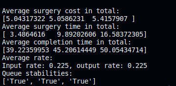
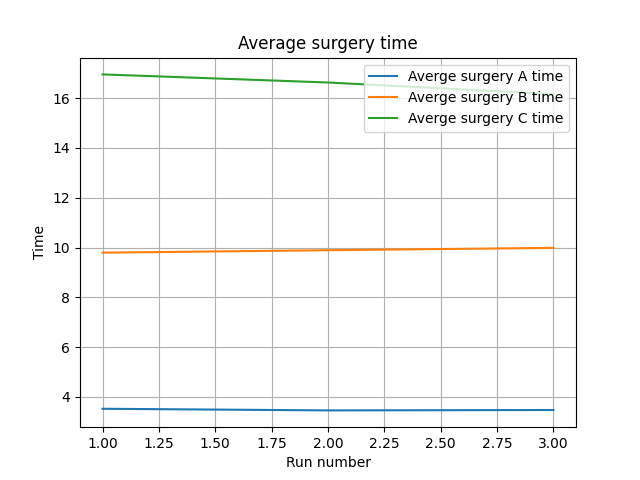
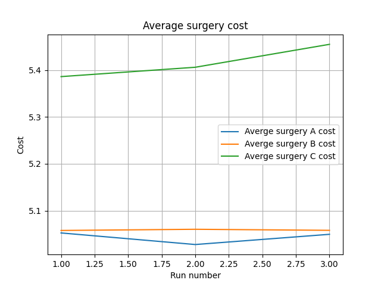
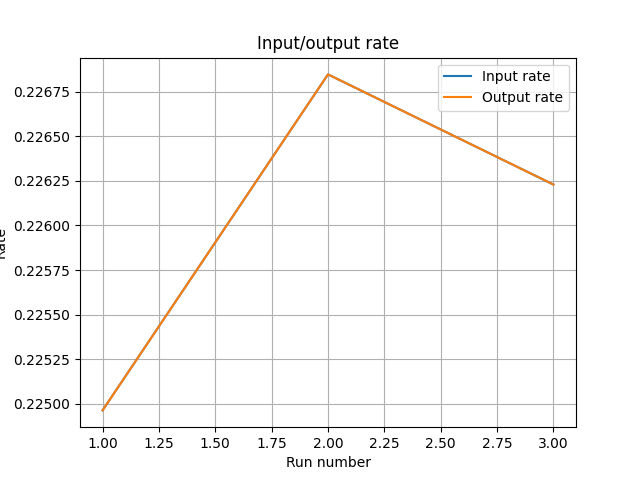
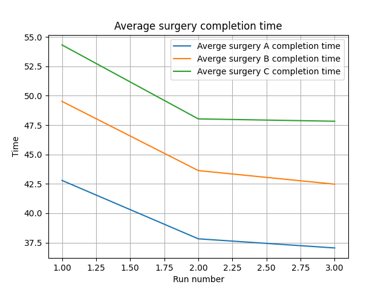

# Game Theory Project - SUT, Spring 2023
This repository contains my implementation of the Game Theory course final project which was held in the Spring 2023 semester. A short explanation of the problem, the structure of the code, how to run it, and the results will be mentioned in this document.

**Contents:**
+ [Project Defenition](#project-defenition)
+ [Code Structure](#code-structure)
+ [How to Run](#how-to-run)
+ [Results](#results)

## Project Defenition
The Persian version of the project is provided in this repository, named `project.pdf`. We want to implement the stable matching algorithm for a given scenario. For more information on the algorithm itself, refer to [Wikipedia](https://en.wikipedia.org/wiki/Stable_marriage_problem). 

We have 3 types of surgeries (namely A, B, and C) and 3 hospitals (namely a, b, c) that can perform the surgeries. On average, the surgery would take 2, 5, and 10 hours respectively in a, b, and c hospitals. However, the rate of performing surgeries is not the same. The following table shows the average time of performing the surgery in each hospital:

| | a | b | c |
|:---:|:---:|:---:|:---:|
| A | 2 | 4 | 6 |
| B | 15 | 5 | 10 |
| C | 20  | 30 | 10 |

Each surgery prefers to be performed in a hospital that is done faster. This defines a preference over hospitals for each surgery request.

On the other hand, each hospital wants to maximize its profit and tends to perform surgeries that would provide him more money. The cost of each surgery in each hospital is as follows:

| | a | b | c |
|:---:|:---:|:---:|:---:|
| A | 2 | 7 | 5 |
| B | 5 | 2 | 7 |
| C | 7 | 5 | 2 |

Surgery requests arrive with a Poisson distribution with the rate of 0.2, 0.1, and 0.05 surgery per hour for A, B, and C, respectively. Also, the assignment of tasks is done in the slot of 8 hours periodically. So, the difference in time between each task is an exponential random variable.

Create a queue of all requests. Every 8 hours, perform the DA (deferred acceptance) algorithm and assign at most 3 surgeries to 3 hospitals. If there are more than 1 requests of the same surgery, the time of the arrival determines the priority. If from the surgery requests that you are performing DA on, there is a surgery that is not assigned to any of the hospitals, it will be transferred back to the queue with the same priority as before.

We want to answer the following questions:

1. Generate many tasks and apply DA on them frequently. Then report the average time of the surgery, the average time from when the request is issued until it's done, and the average cost of each surgery. If the queue is not stable, multiply the rate of task generation by 0.9 and also determine the maximum rate at which the queue is not saturated.
2. Suppose each task can choose not to participate in one or more DA algorithm cycles. This might help one task to achieve better results as in the next cycle its most preferred hospital might be empty. Denote this parameter by `k` and for `k=1,2,3,4,5` answer the previous question.

Do the simulation many times to make sure your results are good enough and consistent.
## Code Structure
There are 3 main modules in this project. `main` is the base module that some of the common objects are defined. `part_a` module consists of the objects and modules that are used for answering the first question. `part_b` is the module of the second question. `part_a.py` and `part_b.py` are the main scripts for running the simulation. The result of the simulation is written into a `CSV` file which then can be read by `analyze.py` to plot the results and take the average of them. 

The list of requirements is provided in the `requirements.txt` file. You only need `Numpy` for simulation and `Matplotlib` for plotting the results. 
## How to Run?
After installing the dependencies, in the root directory of the project, run the following command:
```bash
> python part_a.py
Enter N: 1
Enter num_slots: 10
Enter rate_conf: 1 
----------------------------------------------------------------------------------------------------
At run 0:
Generated 14, 3, and 3 of A, B, C requests
At DA 0
=========================
Required metrics:
Average cost (per surgery): A: 4.143, B: 4.667, C: 3.667
Average surgery time: A: 3.149, B: 7.893, C: 26.511
=========================
Average completion time (per surgery): A: 9.060, B: 7.976, C: 27.256
=========================
Rates:
Input rate: 0.271, output rate: 0.250
Queue is unstable on average
Results saved!
```
In the input, you should enter `N` (number of simulations), `num_slots` (num of simulation slots from which the requests are generated), and `rate_conf` (the multiplier that changes the task issue rate). If you're not in debug mode, you would see the summary of the results. You can change the logger model in the `__init__.py` file of each module.

`part_b.py` code is executed in a similar manner, with the difference that you should also enter the `k` parameter value.

After running the algorithm, create a `results` directory and run the `analyze.py` script from the root directory of the project. You will be asked for the path of the `result.csv` file which is by default created in the root directory of the project. The plots will be saved in the results directory.

## Results
To have accurate results, you should run the code for about 100000 surgery requests. However, this takes a long time on my laptop but it's necessary as the randomness of the problem must be handled. Therefore, I only put the results of part a for about 50000 requests. This is the result of setting the number of slots to be 20000, and running it 3 times with `rate_conf` equal to $0.65$:

|  | |
|:----:|:-----:|
|`analyze.py` output | |
|  | 
|Average surgery time | Average surgery cost |
|  | 
| Average queue IO rate | Average completion time |
